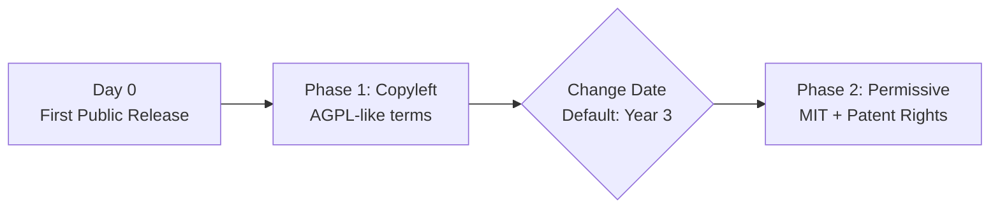

# Daimon Dual Phase License (DDPL) - README

## Overview

The **Daimon Dual Phase License (DDPL)** is an innovative open source license that combines the collaborative benefits of copyleft licensing with the eventual freedom of permissive licensing. It automatically transitions from a strong copyleft phase (similar to AGPL) to a permissive phase (MIT by default) after a specified time period.

## Key Features

### Two-Phase Approach

- **Phase 1 (Copyleft)**: Strong reciprocal obligations designed to encourage contributions back to the community
- **Phase 2 (Permissive)**: Automatic conversion to MIT License (or another specified license) after the change date
- **Default Timeline**: 3 years from first public distribution (customizable)

### Why DDPL?

The DDPL addresses a fundamental tension in open source licensing:

- **For Creators**: Maintain initial control and foster community contributions during critical early development
- **For Users**: Guaranteed eventual permissive licensing eliminates long-term vendor lock-in concerns
- **For Contributors**: Patent protections survive the transition, providing better legal clarity than standard MIT

### Unique Protections

1. **Surviving Patent Grant**: Contributors provide patent licenses that persist even after conversion to MIT
2. **Network Copyleft**: During Phase 1, modifications deployed over networks must share source code (AGPL-style)
3. **Moral Rights Handling**: Sophisticated approach to moral rights that works across jurisdictions
4. **Warranty & Liability**: Disclaimers survive the phase transition

## Understanding the Timeline



## License Considerations

### When to Use DDPL

✅ **Ideal for:**

- Commercial open source projects seeking initial protection
- Projects wanting to build community before full commoditization
- Startups needing investor-friendly IP strategy
- Projects concerned about early competitive forks

❌ **Not recommended for:**

- Projects requiring immediate GPL compatibility
- Pure community projects with no commercial considerations
- Projects needing permanent copyleft protection

### Comparison with Other Licenses


| Feature            | DDPL Phase 1               | DDPL Phase 2  | AGPL      | MIT | Apache 2.0 |
| -------------------- | ---------------------------- | --------------- | ----------- | ----- | ------------ |
| Copyleft           | ✅ Strong                  | ❌            | ✅ Strong | ❌  | ❌         |
| Network Protection | ✅                         | ❌            | ✅        | ❌  | ❌         |
| Patent Grant       | ✅                         | ✅ (survives) | ❌        | ❌  | ✅         |
| Time-Limited       | ✅                         | N/A           | ❌        | ❌  | ❌         |
| Business Friendly  | ⚠️ Strong Copyleft Phase | ✅ Very       | ❌        | ✅  | ✅         |

## FAQ

#### Q: What happens to forks at the change date?

**A:** All forks convert simultaneously. The change date is fixed at the original project's first public distribution, not when the fork was created.

#### Q: Can I change the default 3-year period?

**A:** Yes, specify any date or mechanism in the "Change Date" field. You can set it to any timeframe, or tie it to specific milestones.

#### Q: What licenses can I convert to?

**A:** While MIT is the default, you can specify any permissive license (BSD, Apache 2.0, etc.) in the "Change License" field.

#### Q: Do contributors know about the dual-phase nature?

**A:** Yes, by contributing under DDPL, contributors explicitly acknowledge and consent to the automatic phase transition.

#### Q: How are patents handled?

**A:** Contributors grant patent licenses that uniquely survive the transition to Phase 2, providing better patent protection than standard MIT.

#### Q: Is this compatible with GPL/AGPL during Phase 1?

**A:** No, due to additional terms (particularly around moral rights and the conversion mechanism). However, Phase 2 achieves MIT compatibility.

## Quick Start

To use the DDPL for your project:

1. Download the [license text](Daimon%20Dual%20Phase%20License%20v.1.0.md)
2. Fill in the header fields:
   - **Licensor**: Your name or organization
   - **Program**: Your software name and version
   - **Additional Use Grant**: Any special permissions (or leave blank)
   - **Change Date**: Specific date or mechanism (defaults to 3 years)
   - **Change License**: Target permissive license (defaults to MIT)
3. Include the license file in your repository
4. Add the notice to your source files (see template below)

## SPDX license identifier (ID) and file headers

- What this is: A standard, machine-readable license tag that tools can parse from file headers.
- Use during Phase 1: `SPDX-License-Identifier: LicenseRef-DDPL-1.0`
- Use after Change Date: `SPDX-License-Identifier: MIT` (or your selected Change License, e.g., `Apache-2.0`)
- Recommended extra (REUSE style): `SPDX-FileCopyrightText: 2025 Your Name/Org`

Examples for use during Phase 1 (adapt comment syntax to your language):

- C/JS:
```
  /*
  SPDX-FileCopyrightText: 2025 Your Name
  SPDX-License-Identifier: LicenseRef-DDPL-1.0
  */
```

- Shell/Python:

```
 # SPDX-FileCopyrightText: 2025 Your Name
 # SPDX-License-Identifier: LicenseRef-DDPL-1.0
```

Keep the full license text in the repo: [Daimon Dual Phase License v.1.0.md](Daimon%20Dual%20Phase%20License%20v.1.0.md).

## Usage Example

```
MyAwesomeProject v1.0

Copyright (C) 2025 Tatiana Truedev

This program is free software: you can redistribute it and/or Modify it 
under the terms of the Daimon Dual Phase License as published by Daimon 
Legal, either version 1.0, or (at your option) any later version.

This program is distributed in the hope that it will be useful, but 
disclaims all WARRANTIES OF ANY KIND. This disclaimer covers all 
warranties, whether express or implied such as (but not limited to) any 
warranties of MERCHANTABILITY, FITNESS FOR A PARTICULAR PURPOSE, and 
NONINFRINGEMENT. See the Daimon Dual Phase License for more details.

You should have received a copy of the Daimon Dual Phase License along 
with this program. If not, see https://github.com/Daimon-Law/Daimon-Dual-Phase-License
```

## Compliance quick-checks (Phase 1)

- Source redistribution:
  - Include DDPL text and copyright notices (DDPL §3-4)
  - Keep warranty/liability disclaimers (DDPL §14-15)
- Binaries/object code:
  - Provide Corresponding Source via an allowed method (DDPL §5)
  - For User Products, include Installation Information where applicable (DDPL §5)
- Networked services (SaaS):
  - Prominently offer Corresponding Source at no charge (DDPL §12)
  - Practical options: a UI “Source” link or an endpoint like `/.well-known/source` with repo URL, commit, and source download

### SaaS compliance examples

- `/.well-known/source` (JSON)

```json
{
    "program": "MyAwesomeProject",
    "version": "1.0.0",
    "repository": "https://github.com/YourOrg/YourRepo",
    "commit": "abcdef1",
    "corresponding_source": "https://github.com/YourOrg/YourRepo/releases/tag/v1.0.0",
    "license": "LicenseRef-DDPL-1.0",
    "license_url": "https://yourdomain.example.com/LICENSE",
    "notice": "DDPL v1.0 applies; see LICENSE for details"
}
```

- App footer NOTICE snippet

HTML:

```html
<footer>
    <small>© 2025 Your Org · DDPL v1.0 · Source: https://github.com/YourOrg/YourRepo · Provided “AS IS” without warranties; see NOTICE & LICENSE.</small>
    <!-- Optional: link to /.well-known/source -->
    <a href="/.well-known/source">Source Info</a>
</footer>
```

Plain text (for CLI or logs):

```
© 2025 Your Org · DDPL v1.0 · Source: https://github.com/YourOrg/YourRepo · Provided “AS IS” without warranties of any kind; see NOTICE & LICENSE.
```

## Conversion-day checklist (Phase 2)

- Announce conversion and tag a release with the Change Date
- Add/replace LICENSE with the Change License text; keep the DDPL text for history
- Update README to state current license and that DDPL §§10/14/15/16 survive and take precedence (DDPL §7)
- Update per-file headers:
  - New commits: `SPDX-License-Identifier: MIT` (or your chosen Change License)
  - Note: SPDX can’t encode “surviving terms”; document them in [NOTICE.template.md](NOTICE.template.md)
- If you added Additional Permissions in Phase 1, re-license them under the Change License if you want them to continue (DDPL §7)

## Community & Support

- **License Version**: 1.0 (August 8, 2025)
- **Maintainer**: Daimon Legal Pty Ltd
- **Repository**: [github.com/Daimon-Law/Daimon-Dual-Phase-License](https://github.com/Daimon-Law/Daimon-Dual-Phase-License)
- **Issues**: Please report issues or suggest improvements via GitHub Issues

## Legal Notice

The Daimon Dual Phase License is provided as-is and subject to Daimon Legal's [repository disclaimers](https://github.com/Daimon-Law/Terms-of-Use-for-Daimon-Law-Repositories). Users should consult with legal counsel to ensure it meets their specific needs. "Daimon Legal" and "Dual Phase License" are trademarks of Daimon Legal Pty Ltd.

## Contributing

We welcome feedback and suggestions for improving the DDPL. Please note that the license text itself cannot be modified (per the license terms), but we may incorporate suggestions into future versions.

For contributor terms and patent grant, see [CONTRIBUTING.md](CONTRIBUTING.md) (DDPL §10).

## License for This README

This README file is licensed under CC0 1.0 Universal (Public Domain Dedication).

---

*The DDPL represents an innovative approach to balancing open source ideals with commercial realities. By providing a clear, time-bound transition from copyleft to permissive licensing, it offers a unique solution for projects that want the best of both worlds.*
